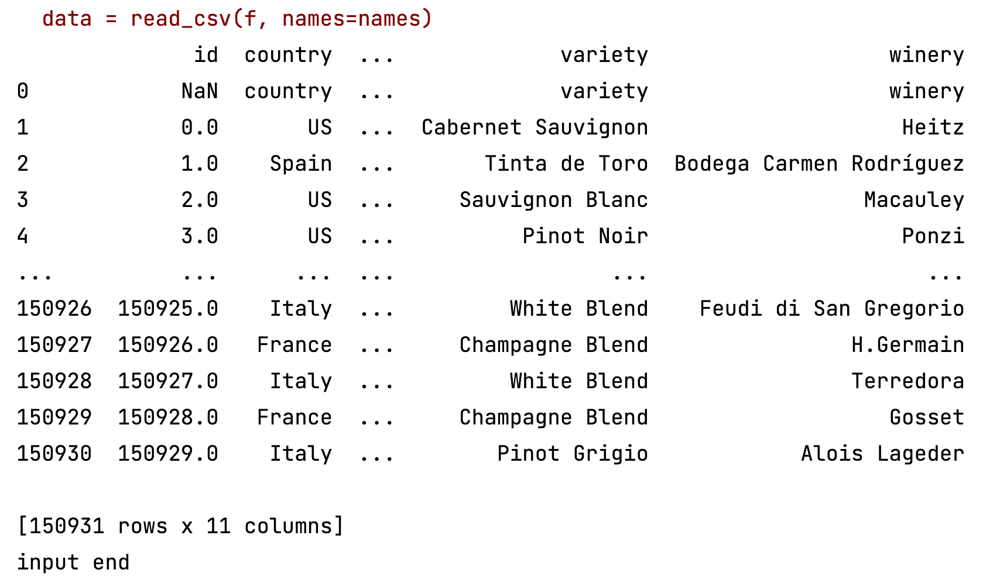
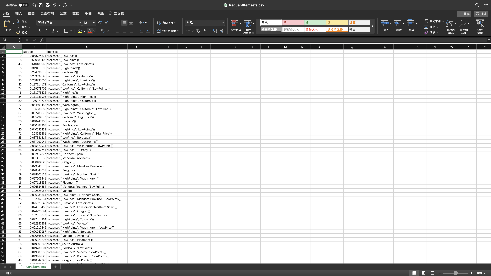
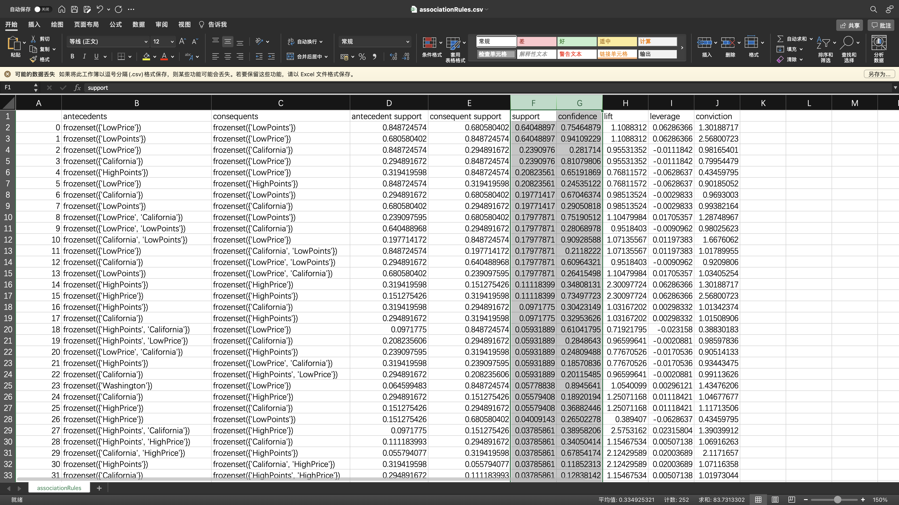
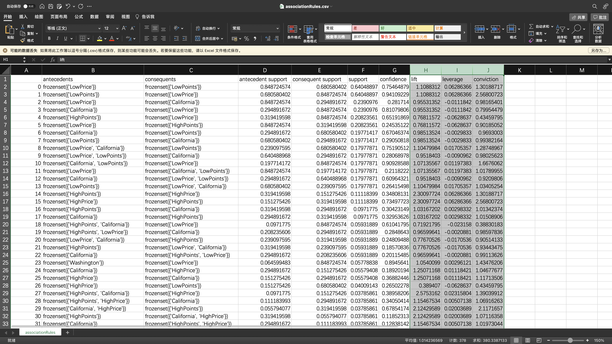
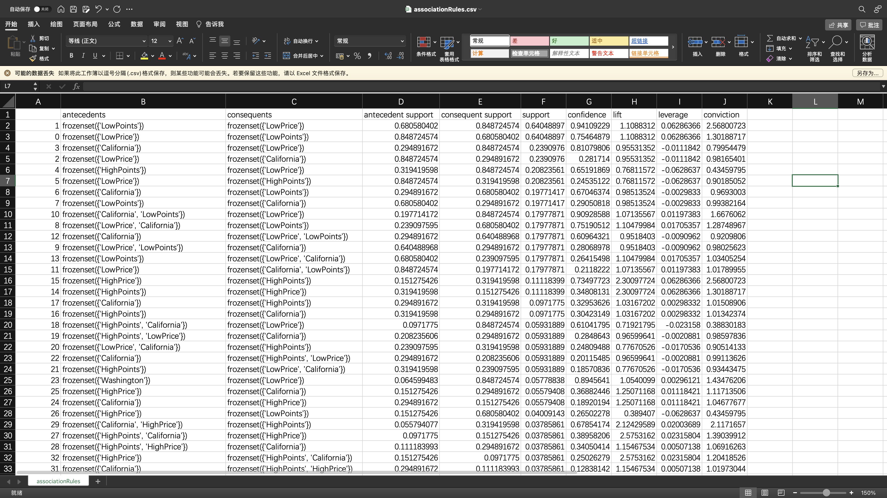
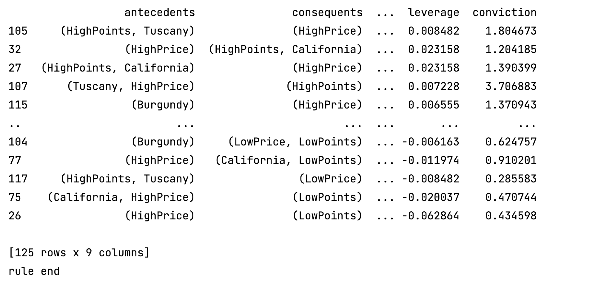

# 数据挖掘互评作业二: 频繁模式与关联规则挖掘

3220211057 茅晓璐 计算机学院

[Github Repository link](https://github.com/Criinal/dataHomework2)

## 数据预处理

### 要求

对数据集进行处理，转换成适合进行关联规则挖掘的形式。

### 思路及代码分析

#### 数据输入

首先，需要从文件 winemag-data_first150k.csv 中读入数据（注：此处需要删除第一行：属性名行），因此需要调用读入 csv 格式数据的模块。选择 __pandas__ 作为数据读入工具。数据中存在空值 __NAN__，首先将其转换成空串。

拟采用 __mlxtend__ 进行频繁模式挖掘，因此需要将数据处理成 mlxtend 所需要的格式。


```Python
from pandas import read_csv

def ReadInputCSV(input_csv):
    f = open(input_csv, encoding="UTF-8")
    names = [
        "id", "country", "description", "designation", "points",
        "price", "province", "region_1", "region_2", "variety", "winery",
    ]
    data = read_csv(f, names=names)
    data = data.fillna("")
    return data
```
<center>
<table><tr>
<td><center>
<br>
<div style="color:orange; border-bottom: 1px solid #d9d9d9;
display: inline-block;
color: #999;
padding: 2px;">读入数据展示</div>
</table>
</center>

#### 数据处理

由于我们要分析的数据是葡萄酒的数据，它包含产地、价格、评分等内容。因此我们需要根据数据的实际意义进行推测。由于价格和评分为 __数值__ 型数据，而在挖掘中采用该类型的数据可能无法很好地反映一组价格相近的数据的情况。因此我们观察数据的总体情况并进行分类。

通过观察数据，我们发现，有 114403 的数据价格在 49.92 以下，占大多数。因此我们以 50 为分界线，认定价格在 50 及以上的数据为 __highPrice__。同理，我们认定 90 分及以上的数据为 __highPoints__。

```Python
# 定义 price >= 50 的数据为高价格
highPrice = []
for price in data["price"]:
    if price == "" or price < 50:
        highPrice.append("LowPrice")
    else:
        highPrice.append("HighPrice")
data["highPrice"] = highPrice

# 定义 points >= 90 的数据为高分数
highPoints = []
for points in data["points"]:
    if price == "" or points < 90:
        highPoints.append("LowPoints")
    else:
        highPoints.append("HighPoints")
data["highPoints"] = highPoints
```

## 频繁模式挖掘

### 要求
找出频繁模式。

### 分析

保留 "province", "highPrice", "highPoints" 三列，对其进行频繁模式挖掘。

```Python
data1 = data[["province", "highPrice", "highPoints"]]
```

首先要进行 encode。encode 的过程是将整个 dataFrame 重新改写，原本的 data[PropertyName] 代表一列属性，而改写后的 dataFrame 为一个只包含 True 和 False 的表格，代表某个属性值是否在当前 id 中存在。

```Python
te = TransactionEncoder()
input_data = data.values.tolist()
print("input data")
for i in range(len(input_data)):
    for j in range(len(input_data[i])):
        input_data[i][j] = str(input_data[i][j])
df_tf = te.fit_transform(input_data)

df = pd.DataFrame(df_tf, columns=te.columns_)
```

进行频繁模式挖掘

```python
print("frequent pattern begin")
# use_colnames=True表示使用元素名字，默认的False使用列名代表元素, 设置最小支持度min_support
frequent_itemsets = apriori(df, min_support=0.01, use_colnames=True)
print("frequent pattern end")
frequent_itemsets.sort_values(by="support", ascending=False, inplace=True)
```

筛选长度为2的频繁模式，并将结果输出到文件

```Python
# 选择2频繁项集
print(frequent_itemsets[frequent_itemsets.itemsets.apply(lambda x: len(x)) == 2])
print("frequent pattern end")
frequent_itemsets.to_csv("frequentItemsets.csv")
```

### 结果展示
<center>
<table><tr>
<td><center>
<br>
<div style="color:orange; border-bottom: 1px solid #d9d9d9;
display: inline-block;
color: #999;
padding: 2px;">频繁模式挖掘结果展示</div>
</table>
</center>

## 关联规则挖掘

### 要求
导出关联规则，计算其支持度和置信度。

### 思路及代码分析

保留 "province", "highPrice", "highPoints" 三列，对其进行关联规则挖掘。并将结果输出到文件。

```Python
association_rule = association_rules(frequent_itemsets, metric="confidence", min_threshold=0.1)
association_rule.to_csv("associationRules.csv")
```

### 结果展示
<center>
<table><tr>
<td><center>
<br>
<div style="color:orange; border-bottom: 1px solid #d9d9d9;
display: inline-block;
color: #999;
padding: 2px;">关联规则挖掘结果，及置信度/支持度</div>
</table>
</center>

## 评价规则

### 要求
对规则进行评价，可使用Lift、卡方和其它教材中提及的指标, 至少2种。

### 思路及代码分析

关联挖掘的结果中自带了一些评价指标，如 __antecedent support/ consequent  support/ support/ confidence/ lift/ leverage/ conviction__

### 结果展示

<center>
<table><tr>
<td><center>
<br>
<div style="color:orange; border-bottom: 1px solid #d9d9d9;
display: inline-block;
color: #999;
padding: 2px;">关联规则评价</div>
</table>
</center>

## 挖掘结果分析

### 要求
对挖掘结果进行分析。

### 分析
对关联规则按照 support 值进行排序，对得到的部分结果进行分析。

- 1. {LowPoints} -> {LowPrice}: 很显然，分值低的红酒其价格也低。
- 18. {HighPoints, California} -> {LowPrice}: 加州产的高分红酒可能具有低价格：物美价廉。
- 22. {Washington} -> {LowPrice}: 华盛顿的红酒可能价格低。

当然也会出现一些不合理的关联规则，例如：
- 4. {LowPoints} -> {HighPrice}: 低分的红酒高价格，这显然是不合理的。出现的原因可能是由于对 __高分数__ 和 __高价格__ 的划分不合理。

### 结果展示
<center>
<table><tr>
<td><center>
<br>
<div style="color:orange; border-bottom: 1px solid #d9d9d9;
display: inline-block;
color: #999;
padding: 2px;">关联规则评价</div>
</table>
</center>

## 可视化展示

### 要求
可视化展示。

### 思路及代码分析

例如：对关联规则按 lift 值排序

```Python
# 关联规则可以提升度排序
association_rule.sort_values(by="lift", ascending=False, inplace=True)
print(association_rule)
# 规则是：antecedents->consequents
```

### 结果展示

<center>
<table><tr>
<td><center>
<br>
<div style="color:orange; border-bottom: 1px solid #d9d9d9;
display: inline-block;
color: #999;
padding: 2px;">关联规则可视化，按 lift 值排序</div>
</table>
</center>
